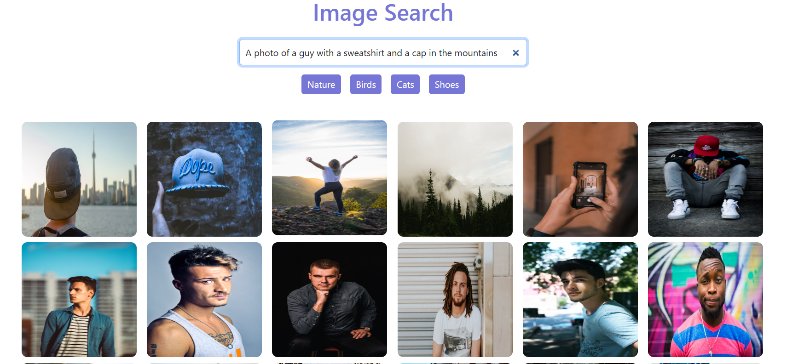
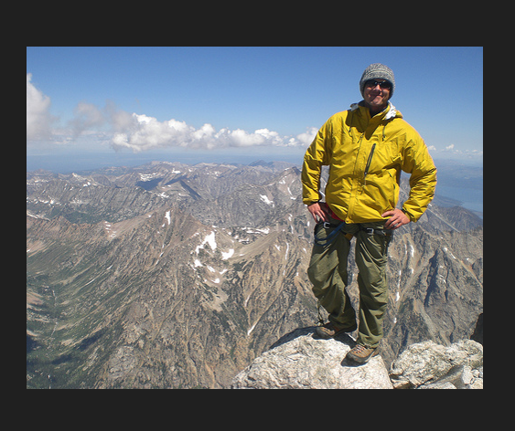

# Differnce between Image Search app using Unsplash APIs vs  Deep Learning model

The key difference between the Deep Learning-based Image Search Engine and the Image Search app using Unsplash APIs lies in their search methodologies and result accuracy. The Deep Learning-based system uses models like CLIP to understand the semantic context of images, allowing it to match visual content based on features, even if there are no explicit tags. This provides more contextually relevant results, as seen with the query "A guy with a sweatshirt and a cap in the mountains," where the system identifies an image of someone in the mountains wearing a jacket. On the other hand, the Unsplash API relies on metadata and tags, which can lead to less accurate or loosely related images, focusing more on keywords in the query. While the Unsplash API offers high-quality images, the results may lack the deep context understanding provided by the machine learning-based approach.

# query
   A photo of a guy with a sweatshirt and a cap in the mountains
## Image Search app using Unsplash APIs      
                       

## Image Search app using Deep Learning model
   

---

# Image Search Engine  using Deep Learning

## Overview
This project is an image search engine utilizing OpenAI’s CLIP (Contrastive Language-Image Pre-training) model. The search engine allows users to input a natural language query and retrieves the most relevant images from a given directory. CLIP is unique in its ability to embed both images and text into the same latent space, enabling efficient comparison between the two using vector similarity.

## Features

- **Deep Learning-Based Search**: Uses CLIP for extracting and comparing image features with text.
- **Efficient Query Handling**: Processes user queries and returns relevant images quickly.
- **Scalable Design**: Capable of handling large datasets efficiently.
- **Customizable**: Users can modify parameters, add new datasets, and extend search algorithms.
- **Support for Various Image Formats**: Supports popular formats like JPEG, PNG, etc.

## Installation

1. **Clone the repository**:
   ```bash
   git clone https://github.com/SOUNDARABHARATH/Image_search_app_ml.git
   ```

2. **Navigate to the project directory**:
   ```bash
   cd Image_search_app_ml
   ```

3. **Create a virtual environment** (optional but recommended):
   ```bash
   python3 -m venv venv
   source venv/bin/activate  # On Windows: venv\Scripts\activate
   ```

4. **Install the required dependencies**:
   ```bash
   pip install -r dev_requirements.txt
   ```

## Prerequisites

Download a sample dataset to build the model from [this Kaggle dataset](https://www.kaggle.com/datasets/adityajn105/flickr8k).

Make sure to set the path to the dataset in `start.py` before running the application.

## Usage

1. **Query Images**:
   
   In `start.py`, you can enter a sample query to search for images:

   ```python
   from PIL import Image
   
   ranked_images = searcher.rank_images("man jumping into river", n=5)
   for image in ranked_images:
       Image.open(image.image_path).convert('RGB').show()
   ```

   You can replace `"man jumping into river"` with other sample queries from the `query.txt` file.

2. **Start the Image Searcher application**:

   To run the application, execute the following command:

   ```bash
   python start.py
   ```

3. **View Results**:

   The system will return and display images matching the query criteria. You can interact with and explore the result set visually.

4. **store image into embeddings**:

   out1 folder store embeddings results

## Project Structure

- `image_searcher/`: Contains core modules responsible for image processing, feature extraction, and search functionality.
- `api/`: Holds API-related code for managing the application's endpoints.
- `tests/`: Unit tests for validating functionality.
- `query result images/`: Example output images for typical queries.
- `pickle_extract.py`: Utility script for extracting embeddings from the dataset.

## Configuration

You can modify configuration options in the `config.yml` file, including paths to datasets, model parameters, and server settings. Below is an example of the configuration structure:

```yaml
image_dir_path: C:/Users/Soundara Barath/Downloads/Images
save_path: D:/Placement projects/ImageSearcher/out1
traverse: true
include_faces: true
reindex: false  # Set to true to force re-indexing of images
n: 42

# Server Configuration
port: 8080           # Specify the port for running the server
host: 127.0.0.1      # Set to localhost
debug: true          # Enable debug mode for development
threaded: true       # Enable threading for performance optimization
```

### Notes:
- **Dataset Path**: Ensure that `image_dir_path` is correctly set to the folder where your images are located.
- **Output Path**: The `save_path` is where image embeddings will be stored.
- **Reindexing**: Set `reindex` to true if you need to recompute the embeddings for the image dataset.
- **Server Options**: Adjust `port`, `host`, and other server options as necessary based on your environment.

